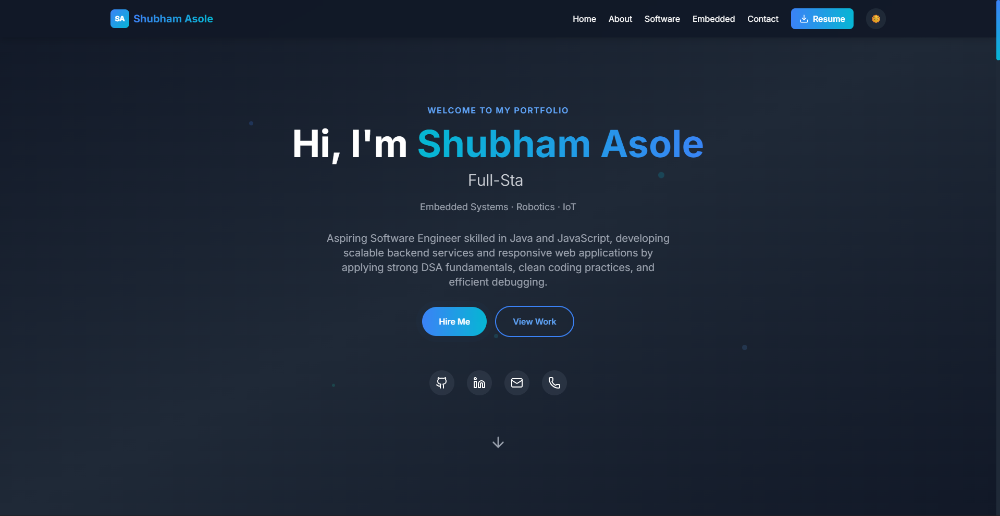
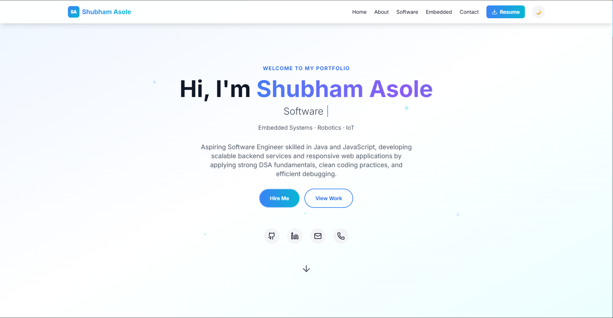

<h1 align="center">
  
</h1>

<p align="center">
  <em>Building scalable backend services and responsive web applications with clean code</em>
</p>

<p align="center">
  <a href="https://asoleshubham0125.github.io/Portfolio">
    
  </a>
  &nbsp;
  <a href="https://www.linkedin.com/in/shubham-asole/">
    
  </a>
  &nbsp;
  <a href="mailto:asoleshubham01@gmail.com">
    
  </a>
  &nbsp;
  <a href="https://github.com/asoleshubham0125">
    
  </a>
</p>

<br/>

<p align="center">
  
  
  
  
  
  
</p>

---

## 📸 Preview

<table>
  <tr>
    <td align="center"><strong>🌙 Dark Mode</strong></td>
    <td align="center"><strong>☀️ Light Mode</strong></td>
  </tr>
  <tr>
    <td></td>
    <td></td>
  </tr>
</table>

---

## ✨ Features

<table>
  <tr>
    <td>🎨</td>
    <td><strong>Dual-Domain Showcase</strong></td>
    <td>Dedicated sections for Software Engineering and Embedded Systems with distinct color schemes</td>
  </tr>
  <tr>
    <td>⌨️</td>
    <td><strong>Animated Hero</strong></td>
    <td>Typing effect cycling through roles with floating particle background and gradient text</td>
  </tr>
  <tr>
    <td>👁️</td>
    <td><strong>Scroll Reveal</strong></td>
    <td>IntersectionObserver-based fade-in animations with staggered children timing</td>
  </tr>
  <tr>
    <td>🌗</td>
    <td><strong>Dark / Light Theme</strong></td>
    <td>Smooth toggle with optimized color-only transitions for instant switching</td>
  </tr>
  <tr>
    <td>💎</td>
    <td><strong>Glassmorphism</strong></td>
    <td>Frosted-glass cards with animated gradient borders and card-shine hover effects</td>
  </tr>
  <tr>
    <td>🔷</td>
    <td><strong>SA Monogram</strong></td>
    <td>Custom SVG favicon with blue-cyan gradient branding across all platforms</td>
  </tr>
  <tr>
    <td>📬</td>
    <td><strong>Contact Form</strong></td>
    <td>Integrated with Formspree for real-time message delivery with status feedback</td>
  </tr>
  <tr>
    <td>📄</td>
    <td><strong>Resume Viewer</strong></td>
    <td>Built-in PDF viewer for Software and Embedded resumes with download option</td>
  </tr>
  <tr>
    <td>📱</td>
    <td><strong>Fully Responsive</strong></td>
    <td>Optimized layouts for mobile, tablet, and desktop with hamburger menu</td>
  </tr>
  <tr>
    <td>🔍</td>
    <td><strong>SEO Optimized</strong></td>
    <td>Proper meta tags, semantic HTML, Open Graph ready, and structured headings</td>
  </tr>
</table>

---

## 🏗️ Architecture

```
portfolio/
│
├── 📂 public/
│   ├── logo.svg                  # SA monogram favicon (SVG)
│   ├── logo192.png               # PWA icon 192×192
│   ├── logo512.png               # PWA icon 512×512
│   ├── index.html                # HTML template + SEO meta
│   ├── manifest.json             # PWA manifest
│   └── 📂 utils/                 # Resume PDFs
│       ├── software_resume.pdf
│       └── embedded_resume.pdf
│
├── 📂 src/
│   ├── 📂 components/
│   │   ├── Header.js             # 🧭 Navbar + SA badge + theme toggle
│   │   ├── Hero.js               # 🚀 Typing effect + particles + CTA
│   │   ├── About.js              # 👤 Education + experience + highlights
│   │   ├── SoftwareSection.js    # 💻 6 skill categories + 8 projects
│   │   ├── EmbeddedSection.js    # 🔧 Hardware skills + 4 projects + internship
│   │   ├── Contact.js            # 📧 Form + info cards + "Why Hire Me"
│   │   └── Footer.js             # 📌 Footer with branding
│   │
│   ├── 📂 hooks/
│   │   └── useScrollReveal.js    # 👁️ Custom IntersectionObserver hook
│   │
│   ├── 📂 pages/
│   │   ├── ResumePage.js         # Resume type selector
│   │   ├── SoftwareResume.js     # PDF embed viewer
│   │   └── EmbeddedResume.js     # PDF embed viewer
│   │
│   ├── App.js                    # ⚙️ Router + theme state management
│   ├── index.js                  # Entry point
│   └── index.css                 # 🎨 Global styles + all animations
│
└── package.json
```

---

## 🚀 Quick Start

```bash
# 1. Clone the repo
git clone https://github.com/asoleshubham0125/Portfolio.git

# 2. Navigate to project
cd Portfolio

# 3. Install dependencies
npm install

# 4. Start dev server
npm start
```

> App runs at **http://localhost:3000** with hot-reload enabled.

#### 📦 Production Build

```bash
npm run build
```

The `build/` folder is ready for deployment on **Vercel**, **Netlify**, **GitHub Pages**, or any static host.

---

## 💼 Featured Projects

<table>
  <tr>
    <th>Project</th>
    <th>Description</th>
    <th>Tech Stack</th>
  </tr>
  <tr>
    <td>
      <strong>⭐ LoadMitrra</strong><br/>
      <a href="https://github.com/asoleshubham0125/LoadMitrraApp">View Code →</a>
    </td>
    <td>Full-Stack MERN freight matching & logistics platform with real-time WebSocket chat, RBAC, and Google Maps integration</td>
    <td>   </td>
  </tr>
  <tr>
    <td>
      <strong>⭐ CLIPFORGE</strong><br/>
      <a href="https://github.com/asoleshubham0125/CLIPFORGE.ai">View Code →</a>
    </td>
    <td>AI-powered viral content generation SaaS with Google Gemini API, credit-based monetization, and Clerk Auth</td>
    <td>   </td>
  </tr>
  <tr>
    <td>
      <strong>StatzHub</strong><br/>
      <a href="https://github.com/asoleshubham0125/StatzHub">View Code →</a>
    </td>
    <td>Zerodha-inspired trading & investment platform with dashboard, Chart.js analytics, and multi-app architecture</td>
    <td>   </td>
  </tr>
  <tr>
    <td>
      <strong>GoBnB</strong><br/>
      <a href="https://github.com/asoleshubham0125/GoBnB">View Code →</a>
    </td>
    <td>Airbnb-inspired booking platform with Passport.js auth, Cloudinary uploads, and Mapbox maps</td>
    <td>   </td>
  </tr>
</table>

---

## 🛠️ Skills

<p align="center">
  
  
  
  
  
  
</p>

<p align="center">
  
  
  
  
  
  
</p>

<p align="center">
  
  
  
  
  
</p>

---

## 📫 Get In Touch

<p align="center">
  <a href="mailto:asoleshubham01@gmail.com"></a>
  &nbsp;
  <a href="tel:+918767239628"></a>
</p>

---

<p align="center">
  <strong>⭐ Star this repo if you found it useful!</strong>
</p>

<p align="center">
  Made with ❤️ by <strong>Shubham Asole</strong><br/>
  BTech ECE · IIITDM Kancheepuram · Class of 2026
</p>
